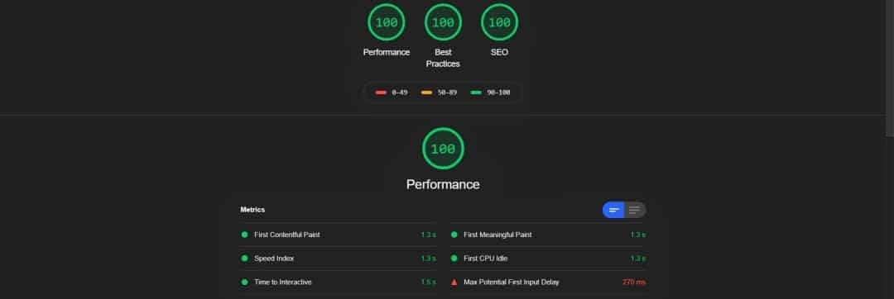

# 🎉 Vue Fake3d image effect

> A fake 3D Image Effect made with WebGL - w/ VueJS - SSR Compatible

[![npm version][npm-version-src]][npm-version-href]
[![npm downloads][npm-downloads-src]][npm-downloads-href]
[![License][license-src]][license-href]

## Installation

This package is available on npm.

```bash

    # Save it as a dep
    npm install --save @luxdamore/vue-fake3d-image-effect

```

### Usage

#### As a component

```js

    // Component
    import { Fake3dImageEffect } from '@luxdamore/vue-fake3d-image-effect';
    import '@luxdamore/vue-fake3d-image-effect/dist/Fake3dImageEffect.css';

    // Install
    Vue.component(
        Fake3dImageEffect.name,
        Fake3dImageEffect
    );

    // Or in a .vue file
    export default {
        components: {
            'fake3d-image-effect': Fake3dImageEffect,
        },
    };

```

#### As a plugin

```js

    // Plugin
    import Fake3dImageEffect from '@luxdamore/vue-fake3d-image-effect';
    import '@luxdamore/vue-fake3d-image-effect/dist/Fake3dImageEffect.css';

    // Install
    Vue.use(
        Fake3dImageEffect
    );

```

#### Browser's way

```html

    <!doctype html>
    <html>
        <head>

            <!-- Fake3dImageEffect style -->

                <!-- Old way -->
                <link rel="stylesheet" href="https://unpkg.com/@luxdamore/vue-fake3d-image-effect@latest/dist/Fake3dImageEffect.css" />
                <!-- end old way -->

                <!-- New way -->
                <link rel="preload" href="https://unpkg.com/@luxdamore/vue-fake3d-image-effect@latest/dist/Fake3dImageEffect.css" as="style" onload="this.rel='stylesheet'" />
                <link rel="preload" href="https://unpkg.com/@luxdamore/vue-fake3d-image-effect@latest/dist/Fake3dImageEffect.umd.min.js" as="script" />
                <!-- end new way -->

            <!-- end Fake3dImageEffect style -->

        </head>
        <body>

            <!--
                Others script (ex. VueJs) and html.
            -->

            <!-- Fake3dImageEffect script -->
                <script src="https://unpkg.com/@luxdamore/vue-fake3d-image-effect@latest/dist/Fake3dImageEffect.umd.min.js"></script>
            <!-- end Fake3dImageEffect script -->

        </body>
    </html>

```

#### Markup

```html

    <fake3d-image-effect
        centered
        fill-height-content
        tag="div"
        image="/imgs/about.jpg"
        image-map="/imgs/about-map.jpg"
    >
        <div class="container">
            <h2>
                Stare out cat door then go back inside
            </h2>
            <p>
                Cat ipsum dolor sit amet, find box a little too small and curl up with fur hanging out,lick left leg for ninety minutes, still dirty. Stand in doorway, unwilling to chose whether to stay in or go out unwrap toilet paper i vomit in the bed in the middle of the night.
            </p>
        </div>
    </fake3d-image-effect>

```

#### Integrations

#### NuxtJS

- Create a file in the `plugins` folder;
- Name it `fake3d-image.client.js`;
- Install it _as a plugin_;
- Import it in the `nuxt.config.js` file as [*client side only*](https://nuxtjs.org/guide/plugins/#client-side-only).

### Options

#### Slots

```bash

    # Available
    slot="default"  # Add some content
    slot="overlay"  # Add an overlay between the default content and the background image
    slot="footer"   # Add a footer to the component

```

#### Props

| Attribute | Type | Default | Required | About |
|:--------------------:|--------------------|:-------:|:--------:|-------------------------------------|
| tag | String | section | false | Tag of the rendered VNode in DOM |
| image | String | null | true | The img-src path |
| image-map | String | null | true | The img-src-map path |
| horizontal-threshold | String, Number | 18 | false | Sensibility for the X-ax |
| vertical-threshold | String, Number | 23 | false | Sensibility for the Y-ax |
| max-tilt | String, Number | 15 | false | Sensibility for the Tilt |
| gyro | Object | { gravityNormalized:true, } | false | [Gyro config object](https://github.com/dorukeker/gyronorm.js) |
| centered | Boolean | false | false | Style, `text-align: center` |
| fill-height-content | Boolean | false | false | Style `height: 100%` for the default slot |
| width | String | 100% | false | Width of component |
| height | String | 100vh | false | Height of component |
___

[npm-version-src]: https://img.shields.io/npm/v/@luxdamore/vue-fake3d-image-effect/latest.svg?style=flat-square
[npm-version-href]: https://npmjs.com/package/@luxdamore/vue-fake3d-image-effect

[npm-downloads-src]: https://img.shields.io/npm/dt/@luxdamore/vue-fake3d-image-effect.svg?style=flat-square
[npm-downloads-href]: https://npmjs.com/package/@luxdamore/vue-fake3d-image-effect

[license-src]: https://img.shields.io/npm/l/@luxdamore/vue-fake3d-image-effect.svg?style=flat-square
[license-href]: https://npmjs.com/package/@luxdamore/vue-fake3d-image-effect

## 🐞 Issues

Please make sure to read the [Issue Reporting Checklist](/.github/ISSUE_TEMPLATE/bug_report.md) before opening an issue. Issues not conforming to the guidelines may be closed immediately.

## 👥 Contribution

Please make sure to read the [Contributing Guide](/.github/ISSUE_TEMPLATE/feature_request.md) before making a pull request.

## 📖 Changelog

Details changes for each release are documented in the [**release notes**](./CHANGELOG.md).

### 📃 License

[MIT License](./LICENSE) // Copyright (©) 2019-present [Luca Iaconelli](https://lucaiaconelli.it)

#### 💸 Are you feeling generous today?  :)

Do you want to share a beer? We can be good friends.. __[Paypal](https://www.paypal.me/luxdamore) // [Patreon](https://www.patreon.com/luxdamore)__

> _It's always a good day to be magnanimous - cit_

#### 💼 Hire me

[](https://lucaiaconelli.it)

[](https://ko-fi.com/luxdamore)

#### 💘 Inspired by

[Fake3dImageEffect by Tympanus](https://tympanus.net/codrops/2019/02/20/how-to-create-a-fake-3d-image-effect-with-webgl/)
> Check `Preparing the image` section for how to do the `image-map`.

___

##### 💡 Lighthouse


